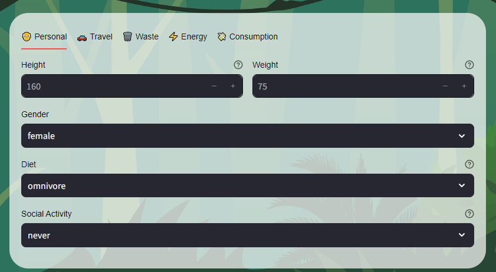
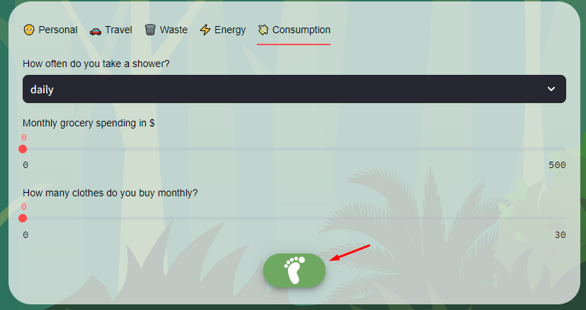
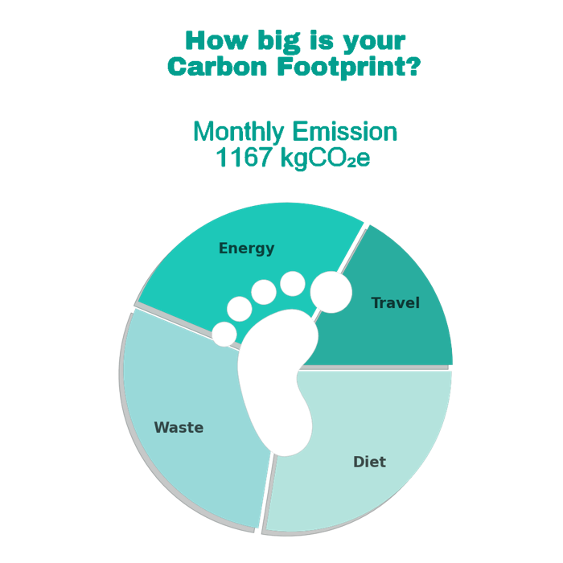

<a target="_blank" href="https://carbonfootprintcalculator.streamlit.app/"></img></a>

## 🌳About Carbon Footprint Calculator Project🌳

The global annual carbon footprint has now surpassed an alarming 40 billion tons, underscoring the urgent need for collective action to mitigate climate change. There exists a direct and undeniable correlation between the daily habits of individuals and the surge in CO2 emissions. Everyday practices, ranging from energy consumption and transportation to residential heating-cooling systems and food production-consumption, significantly contribute to this escalating environmental challenge. Recognizing the pivotal role individuals play in this scenario, it becomes imperative to foster awareness regarding their impact on the global increase in CO2 levels. The core objective of the project is to empower individuals by helping them calculate their monthly carbon footprint. By incorporating considerations of daily, weekly, and monthly habits and lifestyle choices, the initiative aims to offer personalized insights. Furthermore, the project is geared towards not only raising awareness but also providing practical recommendations for individuals to actively reduce their carbon footprints. Through these efforts, the goal is to encourage sustainable living practices that contribute to a more environmentally conscious and responsible global community.
## 🛠️Project Steps
#### 🧩Backend Development:
1. **Data Handling with Pandas:**
   - Used Pandas for data manipulation and analysis.

2. **NumPy for Numeric Operations:**
   - Leveraged NumPy for numerical operations and array manipulation.

3. **Machine Learning with scikit-learn:**
   - Implemented machine learning algorithms using scikit-learn. 

4. **IO Operations:**
   - Utilized the 'io' library for handling input/output operations. 

5. **Data Visualization:**
   - Used Matplotlib for creating visualizations.

6. **Image Processing with Pillow:**
   - Implemented image processing using the Pillow library.

7. **Base64 Encoding/Decoding:**
   - Used base64 for encoding and decoding binary image data.

#### 🖥️Frontend Development:

1. **Streamlit Setup:**
   - Used Streamlit for creating web application.

2. **User Interface Design:**
   - Designed an intuitive user interface using Streamlit components, CSS and Javascript.

3. **Testing:**
   - Tested the complete application to ensure that both the backend and frontend components are functioning correctly.

## 👩‍🏫How to use
Firstly, enter https://carbonfootprintcalculator.streamlit.app/. If the app is asleep due to Streamlit's policy, please wait a few moments for it to wake up.

Click to:

Once on the page, you'll find five tabs. Begin by filling out the form as shown in the image below:

After completing the form, navigate to the 'Consumption' tab and click on the designated button, as indicated in the image:

This will display your Monthly Carbon Footprint as an image, as shown here:

If you wish to offset your carbon footprint, you can proceed by donating trees to a reforestation charity in Turkey, as depicted in the following image:

